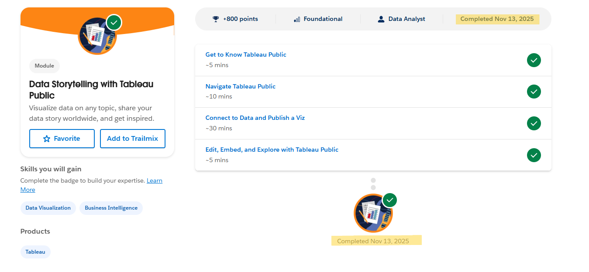
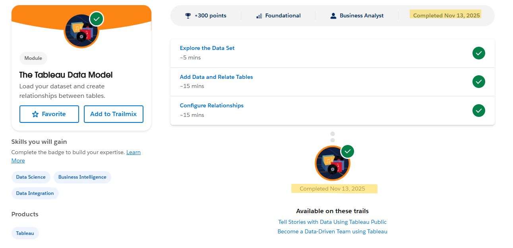
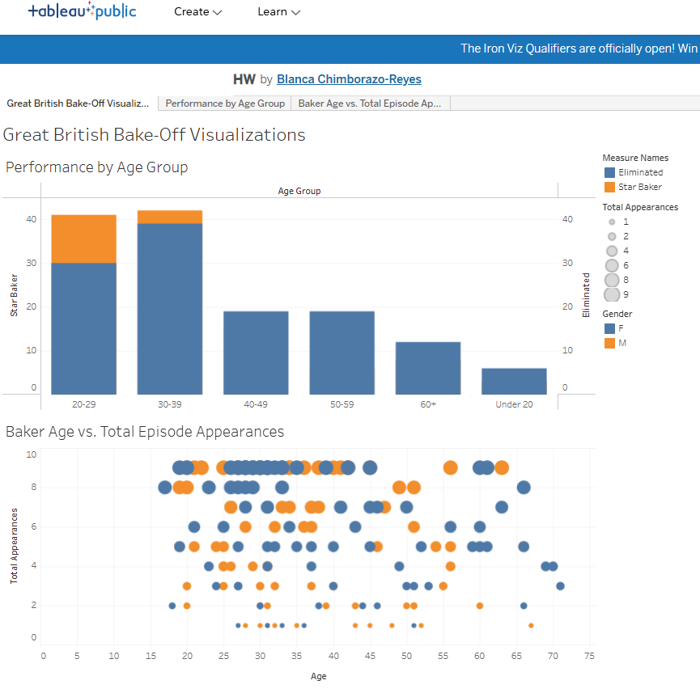
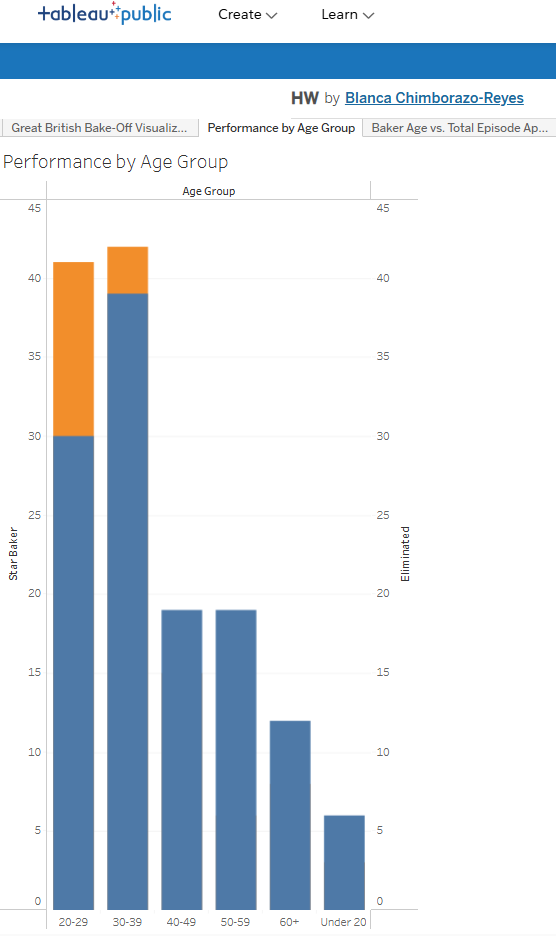
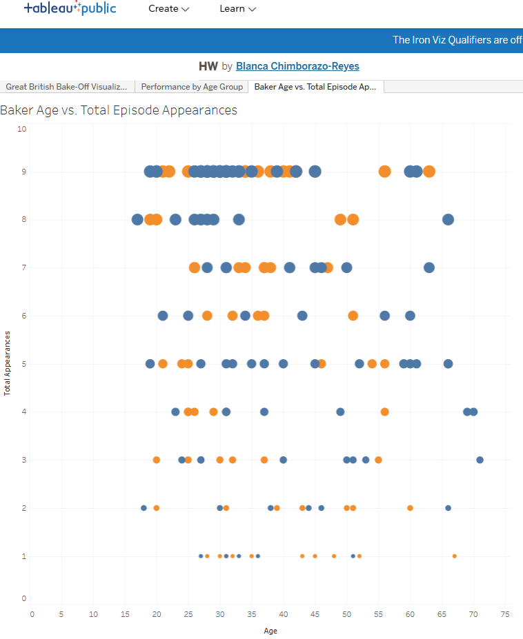

# tableau_trailhead_basics
- Name: Blanca Chimborazo-Reyes
- Goal of Assignment: Learn to create and publish a Tableau public visualization

# Trailhead Module Badges
- Link of Trailhead Profile showing completed badges: https://www.salesforce.com/trailblazer/bdzpi6v9z7fjof7htb
## Data Storytelling with Tableau Public - Completed on 11/13/25

## The Tableau Data Model - Completed on 11/13/25

## Badges for Courses

# Tableau Public Visualization
## Great British Bake Off
- Tableau Visualizations Link: https://public.tableau.com/views/HW_17630876694930/Dashboard1?:language=en-US&:sid=&:redirect=auth&:display_count=n&:origin=viz_share_link
- The datasets used for these visualizations are "Bakers" and "Outcomes", these can be found in the "datasets used" folder. 
### Dashboard
- This dashboard presents an analysis of Great British Bake Off performance metrics focusing on age and total competition time. The top visualization, Performance by Age Group, compares the frequency of major achievements (Star Baker wins) against Eliminations across different age brackets. The bottom visualization, Baker Age vs. Total Episode Appearances, maps individual baker performance to their specific age. Collectively, the dashboard suggests that the highest volume of competition (both success and elimination) is concentrated among younger bakers, while the performance of older bakers shows greater variability.

### Visualization 1: Performance by Age Group
- Question: How does the performance (Star Baker wins vs. Eliminations) vary across different age groups?
- Results: The Performance by Age Group bar chart clearly shows that the 20-29 and 30-39 age groups account for the vast majority of both Star Baker wins and Eliminations. This indicates these groups have the highest overall participation and competition intensity. Bakers in the 40-49 age group and older have significantly fewer total achievements or eliminations, implying fewer overall participants or a lower average duration in the competition for these age groups.

### Visualization 2:Baker Age vs. Total Episode Appearances
- Question: Does a baker's age relate to how many episodes they compete in?"
- Results: The Baker Age vs. Total Episode Appearances scatter plot reveals a pattern where the highest number of episode appearances (reaching 9 or 10 episodes) is heavily clustered in the 20s and 30s age range, confirming the results of the bar chart. Beyond the age of 40, bakers are much less likely to participate in a high number of episodes, with most of those points falling below the 7-episode mark. This suggests that while older contestants do compete, they either tend to be eliminated earlier or are simply less numerous in the dataset. There doesn't appear to be a clear, linear negative correlation between age and total appearances, but rather a concentration of long-running bakers in the younger age groups.

## Reflection
- I found the principle of **context** from the Data Storytelling with Tableau Public module to be the most important. It guided the creation of my first visualization by showing both Star Baker wins and Eliminations by age group. The dual axis approach that I used provided context on success vs failure. A key concept from the Tableau Data Model is the use of Relationships instead of joins, which matters in real-world datasets because it prevents double-counting (data duplication) when measures are aggregated across tables, ensuring counts are accurate. 
In a healthcare scenario, this concept of Relationships is crucial for tracking readmission rates; one table might contain patient visits, and a related table might contain readmission flags. Using a Tableau relationship ensures that when aggregating patient outcomes by a metric like age or diagnosis (from the visit table), the corresponding readmission flag (from the outcome table) is only linked when needed, making Tableau an ideal fit for these kinds of situations. 
